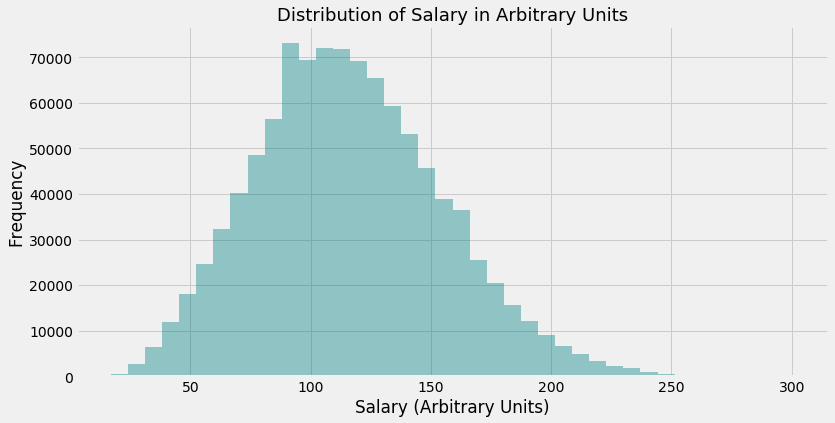
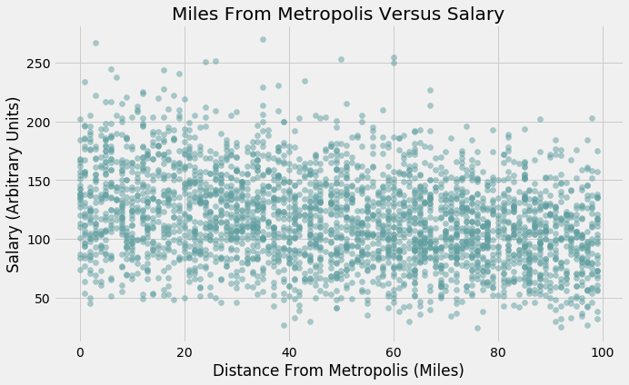
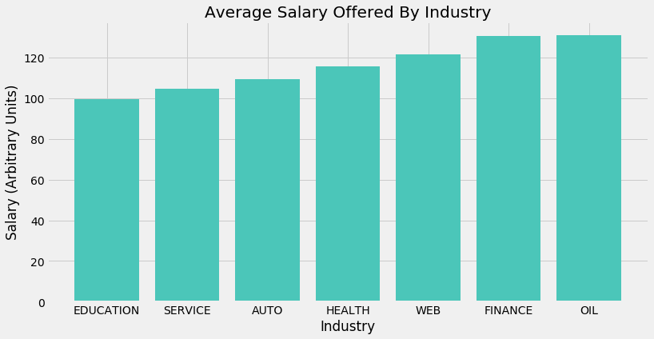
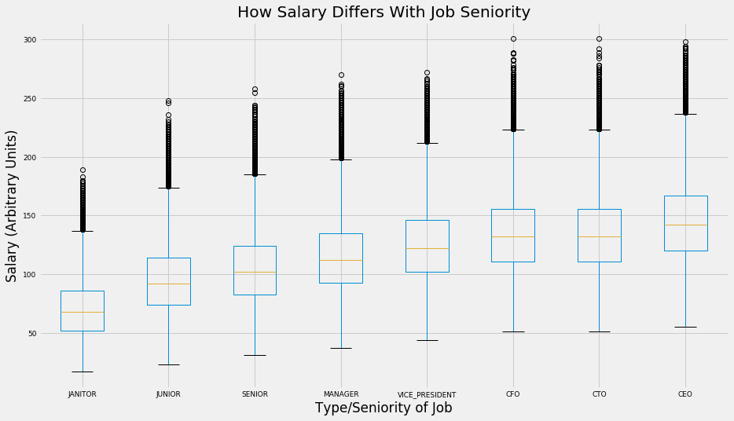
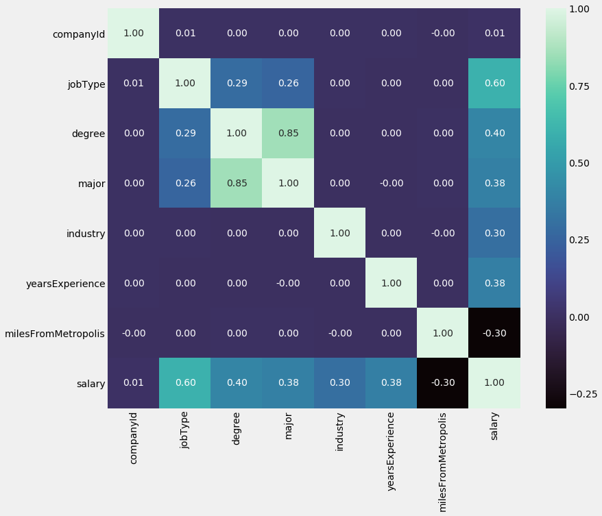
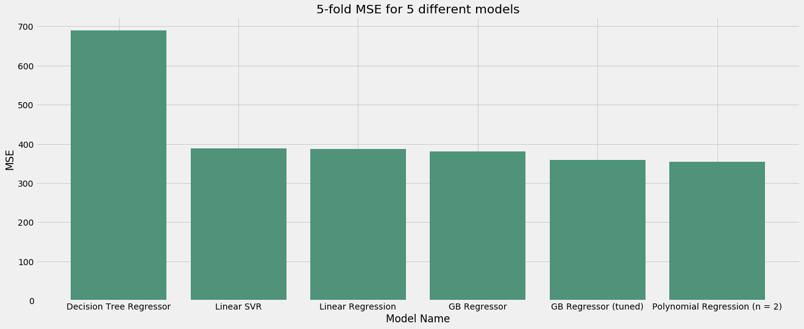

# Problem exposition, Business Value and Data

This project aims to predict salaries for job postings given a set of features that include but is not limited to Degree Requirement, Industry of Job, Miles From Metropolis and Major Required. Thus, it is a supervised learning, regression task.

The business value in this problem can be manifold and could relate to a variety of different interested parties:

- **For a company**: Accurate predictions may allow a company to offer 'fair' salaries to potential applicants. By 'fair', we mean salaries that are similar to those in existing roles, account for the variance in each role in terms of industry, experience required and so on

- **For government and research institutions**: to study the state of the job market in terms of salaries offered. This would provide information on key drivers of the job market in particular and the economy in general. For example, if jobs requiring a degree in Engineering consistently offer higher salaries, then this would be an indication that such roles are an important building block of the economy, and thus the government may consider promotion of educational initiatives that encourage people to pursue engineering degrees

- **For job applicants**: An accurate predictor would allow job applicants to assess if they are being offered a 'fair' salary given their skills and experience. This is much the same as the first entry for a 'company', except from the opposite point of view

There are 1 million observations in the dataset with 8 pre-existing features. I hypothesise that these variables hold significant predictive potential that can considerably outperform a simple baseline prediction

# Approach and Insights

## Cleaning and EDA

I started by cleaning the data and exploring the most interesting variables. Apart from a very small number of erroneous observations, where the outcome (Salary) was given a value of 0, the data was mostly clean and ready to be investigated.

I explored univariate distributions of interval variables, including Salary, Years of Experience Required and Miles From Metropolis in addition to bivariate relationships that included finding out how the offered Salary differed among different Industries and with Years of Experience Required.

Among other things, this investigation found that:

- the outcome variable Salary was normally distributed with a slight positive skewness

- Distance from Metropolis and Salary had a weak relationship

- Small but significant differences existed in salaries offered by various Industries

- The above also held true for job seniority vs salary; senior roles paid much more than junior ones

 

Weak correlations, both negative and positive, were found for the bivariate investigations. The univariate relationships were mostly normally distributed with a small degree of skewness.

Before feature engineering, correlations were found to be in the mild-to-moderate range, as suggested by coefficients that ranged from 0.38 to 0.6.

## Feature Engineering

I mostly concentrated on correctly encoding the 4 categorical variables in the data. Two of these were nominal (Degree, Job Type) and two were ordinal (Industry, Major), so manual encoding to preserve the order of values was used in the former case and dummy encoding was used for the latter. The correlation coefficients for these variables were significantly higher than those of the pre-existing variables, ranging in between 0.38 to 0.6

I did not create any interaction variables because no such combination made intuitive sense.

## Models

My approaches here included:

- Linear Regression
- Polynomial Regression
- Linear SVM
- Gradient Boosting Regressor

I chose these models because they contain a good mix of model complexity, ranging from the simple with Linear Regression to the more complex for the ensemble method of GB Regressor.

# Results

I succeeded in the goal of improving upon the score of my baseline prediction. The best performing model was Polynomial Regression, which resulted in an MSE of 354 units. This is a 74.1% improvement over the baseline model MSE of 1367.12

# Future Enchancements

In terms of what could be improved upon, more advanced models such as neural networks could be used. More feature engineering could be undertaken, such as creating simple minimum, maximum and average salaries for each value of Industry, Degree and Major.

Finally, all models used could have been tuned. I implemented Grid Search for GB Regressor only due to computational constraints. It is possible that the other models could be the best-performing if their hyperparameters were tuned.
